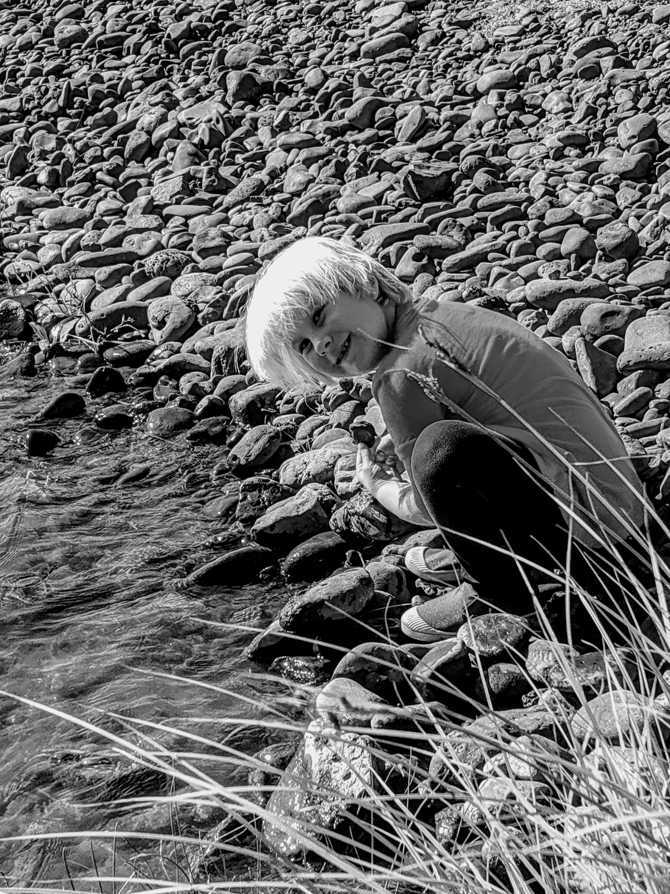
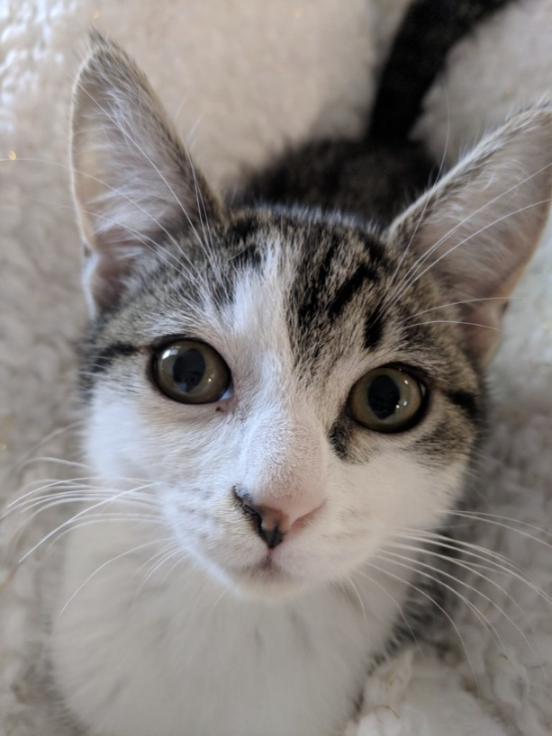
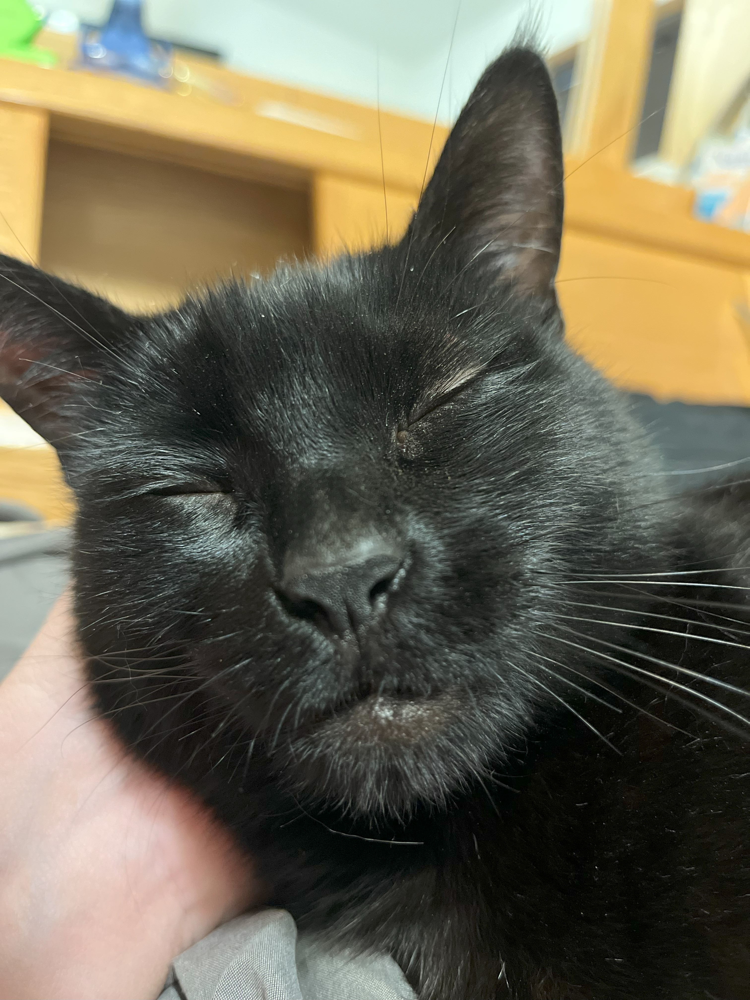

<figure markdown="span">
  { width="600" }
  <figcaption></figcaption>
</figure>

[](https://github.com/joshooaj/PerceptHash/actions/workflows/CI.yaml)

# Compare images with PerceptHash

Using the PerceptHash module on Windows, linux, or macOS, you can generate
"perceptual hashes" with the `Get-PerceptHash` command which is designed to
look and feel _similar_ to the `Get-FileHash` cmdlet.

```powershell
$ProgressPreference = 'SilentlyContinue'
Invoke-RestMethod http://localhost:8000/assets/images/photo3.jpg -outfile ./photo3.jpg
Get-PerceptHash ./photo3.jpg

<# OUTPUT

Algorithm Hash             Path
--------- ----             ----
    dhash C0600030F8BD3D7C C:\temp\photo3.jpg

#>
```

## Install

```powershell
Install-Module PerceptHash
```

## Usage

Use the `Get-PerceptHash` cmdlet with the path to an image file with a common
extension like `.jpg`, or `.png`, and a `PerceptHash` object with the algorithm
name, hash, and file path is returned.

```powershell
Get-PerceptHash ./images/*.jpg
```

When you have two or more images, you can generate perceptual hashes for all of
them, then use the `Compare-PerceptHash` cmdlet to calculate the binary
**hamming distance** between two perceptual hashes.

```powershell
$hash1 = Get-PerceptHash photo1.jpg
$hash2 = Get-PerceptHash photo2.jpg
Compare-PerceptHash $hash1 $hash2
```

## Interpretation

Each hash represents 64 segments of an image, each represented as a single bit.
The 64bit hashes are compared using `Compare-PerceptHash`, and a number between
0 and 64 is returned. This number represents how many bits are _different_
between the two hashes.

A value of 10 or under is usually a good indication that the two images are
_similar_. Values closer to zero are _more similar_. Likewise, a value greater
than 10 indicates that the two images are probably _dissimilar_.

This algorithm is far from perfect considering the hashes are created by
distilling the source file down to a 9x8 grayscale image, however the algorithm
works well when used to simply bring similar images to your attention.

## The algorithm

I hear and use the word "hash" on a regular basis, and have used all kinds of
cryptographic hashes over the years including md5, bcrypt, and the various sha's.
But these are fundamentally different algorithms with almost polar opposite
goals. The kind of hashs I was familar with were designed to produce _wildly_
different results from two sets of data if even a __single bit__ was different
between them. The resulting hashes were either the same, indicating that the
inputs were _very likely_ the same (collisions happen, but they're hard to find),
or they were different, indicating that the inputs were _definitely_ different.
There should be no way to measure how similar two inputs are based on their SHA
hashes. If you could, the algorithm would be too weak to use for any kind of
security or privacy on the web.

In contrast, a perceptual hash like dHash will, by design, produce the same or
similar hash when given two images that are nearly identical. And since each bit
in the 64bit hash represents a part of the image, you can calculate the
[hamming distance](https://en.wikipedia.org/wiki/Hamming_distance) between two
hashes to determine how many of the 64bits in the two hashes are different.
Fewer differences indicate a higher likelihood that the hashes are from the same
or similar images.

Here's a quick summary of the dHash algorithm:

1. Reduce the size to 9x8 pixels. Don't worry about the original image size or aspect ratio.
2. Convert to grayscale because we only care about the "brightness" of each pixel.
3. Compare each pixel's brightness to the neighbor on the right. This is why the image is resized to 9x8 - we need 8 bits per row.
4. Assign a bit value of "1" if the current pixel is brighter than the neighbor on the right.

You will end up with one byte per row, and 8 rows, for a total of 64 bits. Convert
the array of bytes to a hexadecimal string and you have your dHash.

## Examples

### Nearly identical

These photos of my daughter at the river are nearly identical to the untrained
eye, but the raw files are very different. In the following table you'll find a
side-by-side comparison of what appears to be the same image, and their dHashes
along with a SHA1. For fun, you'll also find the 9x8 grayscale versions from which the
dHashes were derived.

The hamming distance between the dHash values from these images is 2, which means
two out of the 64 bits of the hash were different, so as you would expect, the
hash comparison shows that the images have a strong visual similarity.

| Photo 1                                        | Photo 2                                        |
| ---------------------------------------------- | ---------------------------------------------- |
| { width="300" }          | { width="300" }          |
| { width="300" }    | { width="300" }    |
| dHash: 83AD9B9CEC762888                        | dHash: 83A99B9CEC762898                        |
| SHA1: 80187EB0E86F2FCDE82E60D7CD53BB0B1B1FF686 | SHA1: 5BC13493BB94536C3EAE794A924C1D9A00D207D6 |

```powershell
$hash1 = Get-PerceptHash photo1.jpg
$hash2 = Get-PerceptHash photo2.jpg
Compare-PerceptHash $hash1 $hash2
```

### Image filter applied

In this next example, the first image is the original and the second has been
"color enhanced". We can see that the images are _definitely different_, but we
can also see that they're most likely the same image with different colors.
When we compare the dHashes, we get a difference of 6. Since that is still well
under 10, we can be fairly confident that the images are similar.

| Photo 3                                        | Photo 4                                        |
| ---------------------------------------------- | ---------------------------------------------- |
| { width="300" }          | { width="300" }          |
| { width="300" }    | { width="300" }    |
| dHash: 60606040587c5c7c                        | dHash: 60606040d87c5d7c                        |
| SHA1: BDE8B4AB0DC4E28D4DA72A982E4B99159E72EA9C | SHA1: C624DC07813ABBC07E286665AF7A41941F19F9AF |

```powershell
Get-PerceptHash photo3.jpg | Compare-PerceptHash -DifferenceHash 60606040d87c5d7c
```

### Very different cats

Okay in this last example, just to demonstrate that the algorithm doesn't consider
all images similar, here are two very different cats because... internet. The
dHash comparison returns a value of 24.

| Photo 5                                        | Photo 6                                        |
| ---------------------------------------------- | ---------------------------------------------- |
| { width="300" }          | { width="300" }          |
| { width="300" }    | { width="300" }    |
| dHash: 9CDCF8CC6C37762E                        | dHash: 9C8878D1ABC6EC7E                        |
| SHA1: 51E2DFE65974C86740C314E7883D22C163D3EA1B | SHA1: A58DBDAA875B5FC311BBB35A74748E68550CFC12 |

```powershell
$hashes = Get-ChildItem *.jpg | Where-Object BaseName -match 'photo[56]'
Compare-PerceptHash -ReferenceHash $hashes[0] -DifferenceHash $hashes[1]
```
